# Welcome to the Game Night Recommender Repository

This tool is designed to enhance your multiplayer gaming sessions by providing personalized game recommendations based on user preferences and social interactions.

## Project Overview

The Game Night Recommender is a web application that helps groups of friends choose video games to play together more efficiently. It integrates with platforms like Discord for seamless communication and leverages APIs such as Steam to fetch game data.

### Key Features

- **User Authentication:** Secure login and registration. Steam ID credential stored in encrypted format.

  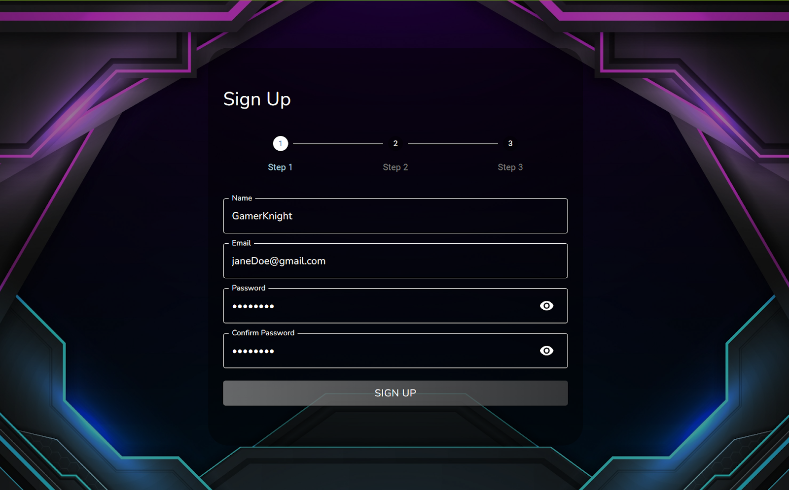

- **Game Discovery:** Browse games your friends are playing or explore top-rated games.

  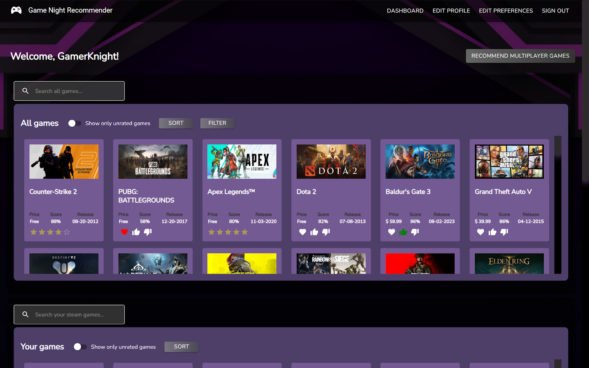

  

    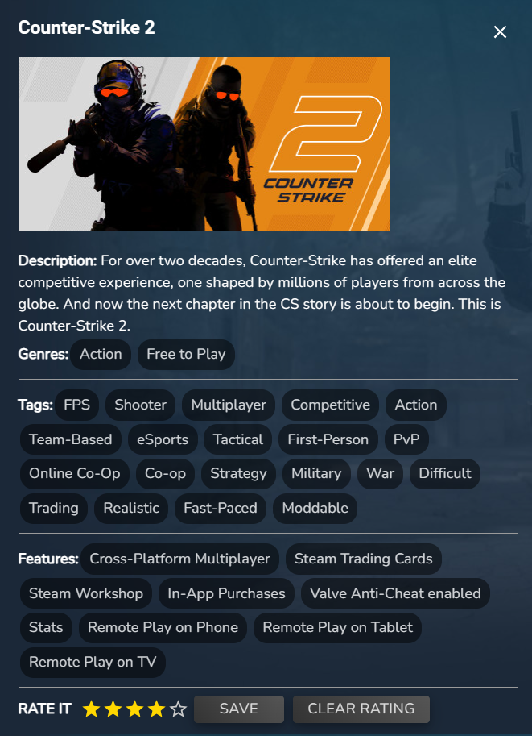
    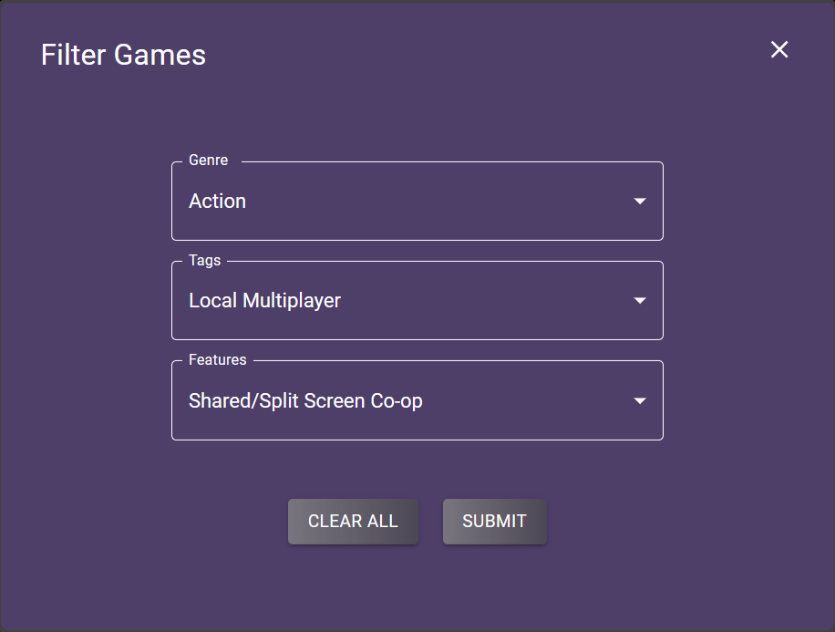
  
 

- **Game Interaction:** Rate games, express interest, and select preferred genres.

  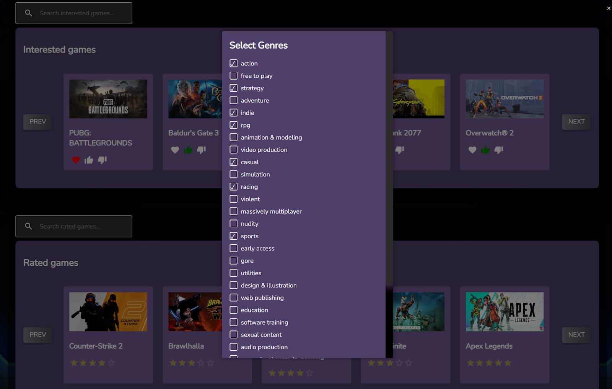

- **Recommendation System:** Get personalized game suggestions based on collective preferences of your group.

  

    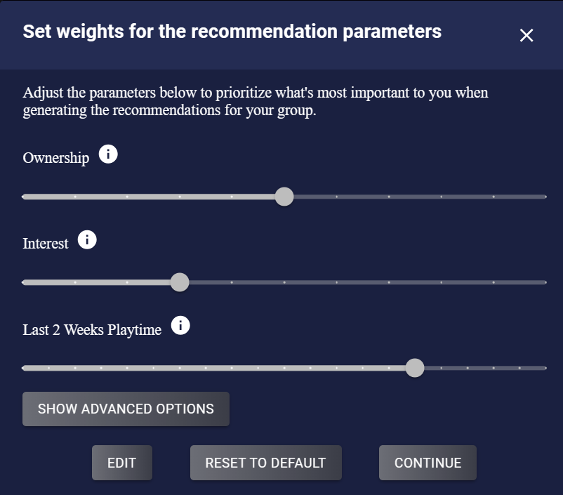
    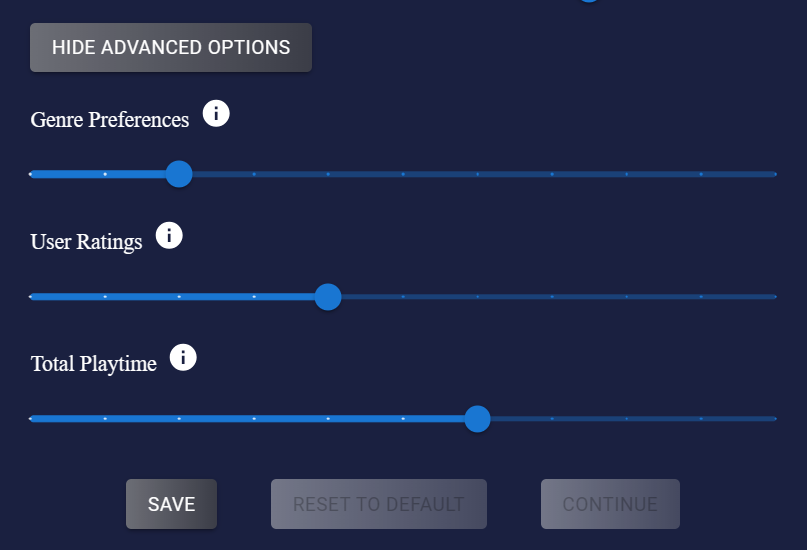
  

  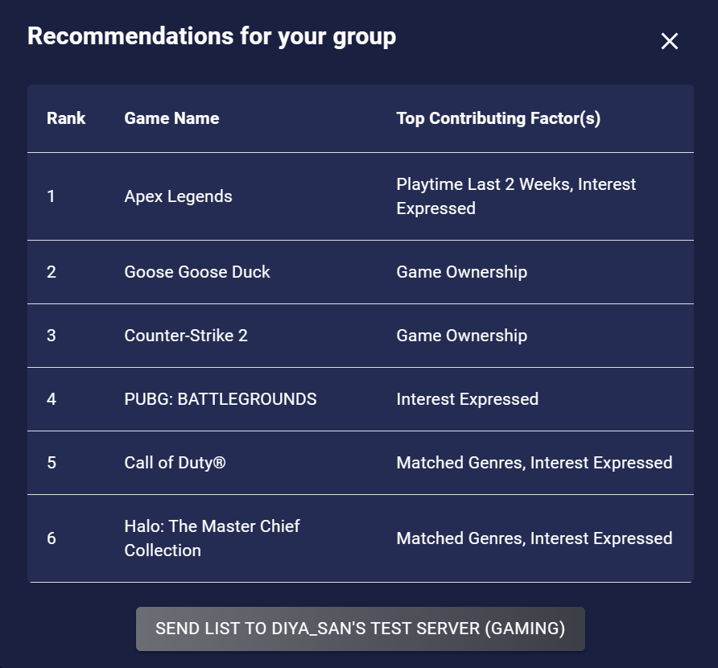

- **Discord Integration:** Connect with friends and send game recommendations directly to your Discord server's channel.

  

    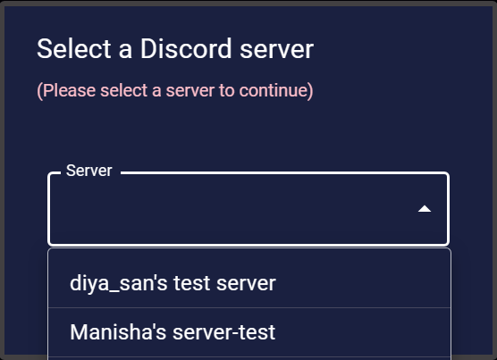
    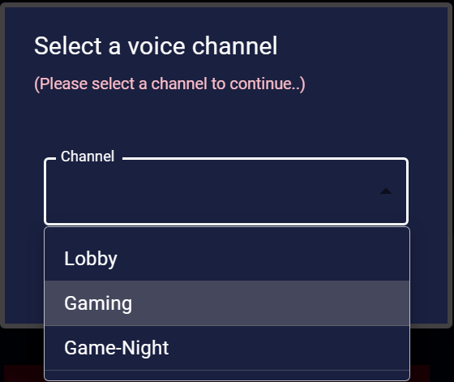
  

  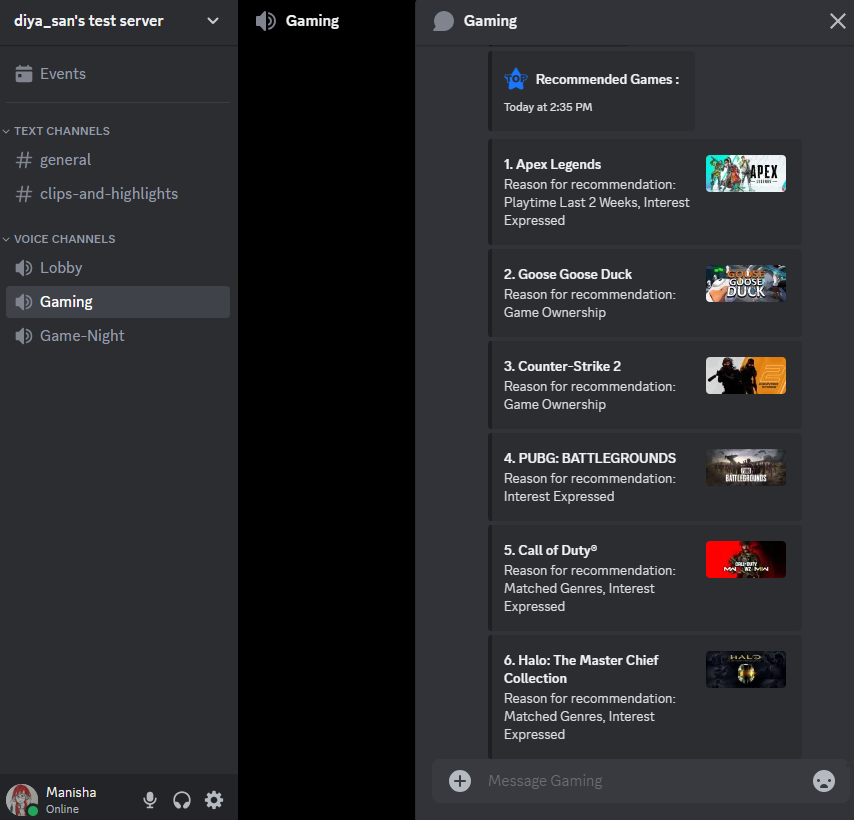

## Installation Guide
### STEPS TO RUN THE APPLICATION

### Add .env to Frontend folder and add the below contents to it
REACT_APP_BASE_URL=http://localhost:8080/api

### Add .env to Backend folder
PORT=8080
MONGO_URL=<MONGO_DB_URL_HERE>
JWT_SECRET_KEY=<SECRET_KEY_HERE>
RAWG_API_KEY=<RAWG_API_KEY_HERE>
STEAM_API_KEY=<STEAM_API_KEY_HERE>
BOT_TOKEN=<BOT_TOKEN_HERE>
AGE_SENSITIVE_TAGS=<AGE_SENSITIVE_TAGS_HERE>
STEAM_SECRET_KEY=<STEAM_SECRET_KEY_HERE>
STEAM_SECRET_IV=<STEAM_SECRET_IV_HERE>

### TO Run the Backend application
1. Naviagte to /backend folder.
2. `npm install`
3. `npm start`

### Packages Installed For BACKEND
1. cors - for FE and BE communication.
2. dotenv - to store sensitive information like api keys, port number etc.
3. express - framework for managing backend.
4. mongoose - to communicate with the mongo db.
5. morgan - For logging requests to help debugging.
6. nodemon - for hot reload.

### TO Run the Frontend application
1. Naviagte to /frontend folder.
2. `npm install`
3. `npm start`

### Packages Installed For FRONTEND - ReactJS
1. Material UI - for implementing UI components.
2. Axios - for interating with backend and others services using RESTful APIS.
3. Scss - for css.

### Access the Application locally in : http://localhost:3000
### Access AWS Application URL (is down sometimes, working on AWS limits): http://ec2-54-208-76-220.compute-1.amazonaws.com/home